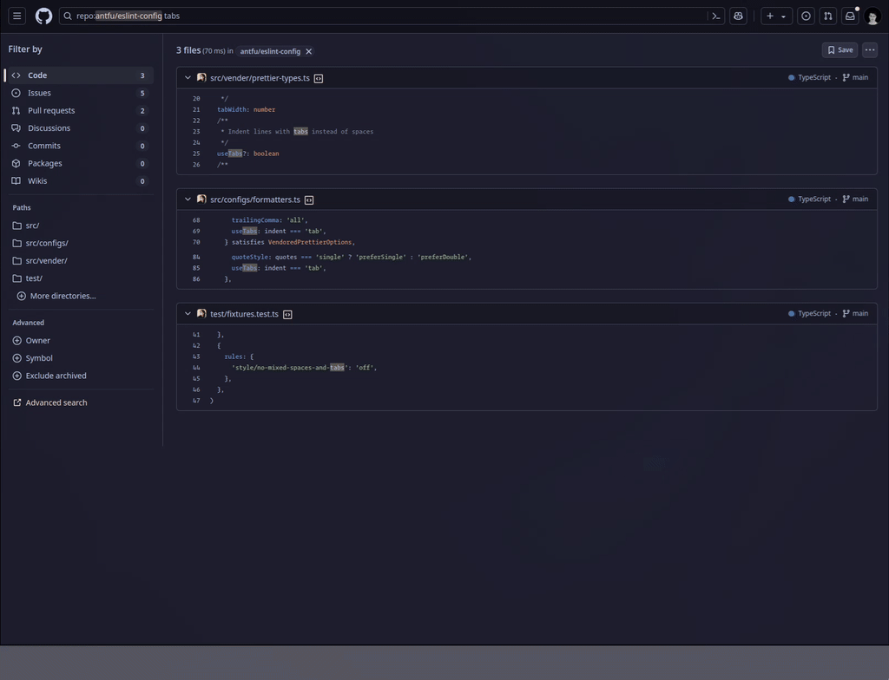

# github-search-preview

Recreate the search result modal preview feature from [grep.app](https://grep.app) in GitHub! 

Tired of browsing GitHub search results and having to "<kbd>ctrl</kbd> + click" each individual file and then jump back and forth among so many tabs? With this extension you can preview the full file search result directly in-context in a modal on the GitHub search results page.

> Many thanks to [refined-github](https://github.com/refined-github/refined-github) for the bones of this extension :pray:

## 🏗️ Features

- Adds a "Open Preview" button next to each file in the GitHub code search results page
- Clicking this button opens the full file in a preview dialog
- Directly copy full file contents from the dialog
- Open the file from the dialog in a background tab

## 🛟 Installation

1. [Chrome Web Store](https://chromewebstore.google.com/detail/github-search-preview/lhcbjnlpnjadiefblndnhkaigmagafpo)
2. [Firefox Addon](https://addons.mozilla.org/en-US/firefox/addon/github-search-preview/)
3. Manual installation

    1. See the [releases](https://github.com/ndom91/github-search-preview/releases) page for the latest release.
    2. Go to your browsers extension page (i.e. `chrome://extensions`)
    3. [Enable developer mode](https://developer.chrome.com/docs/extensions/get-started/tutorial/hello-world#load-unpacked).
    4. Drag and drop the `.zip` file below onto the page. 

## 🖼️ Screenshot

## 📝 License

MIT
